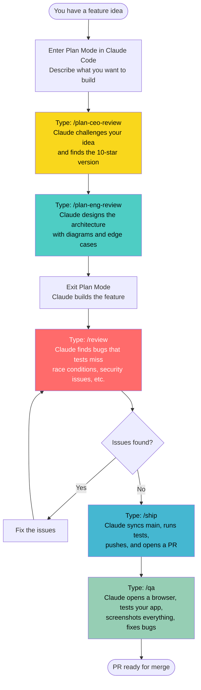
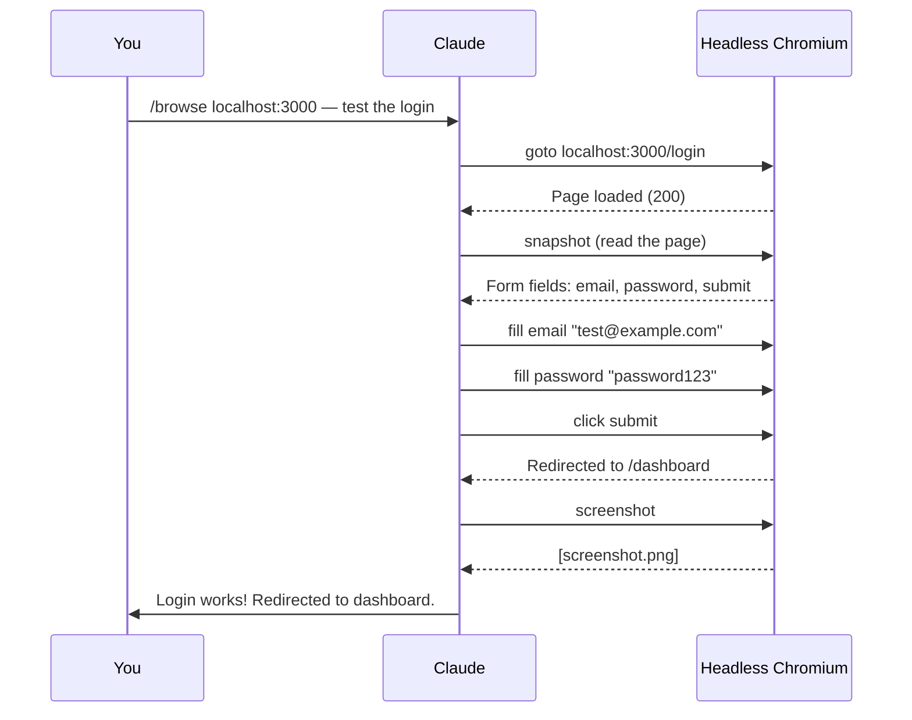

# gstack Quickstart

A simple guide to using gstack — slash commands that give Claude Code different "brains" for different jobs.

## What is gstack?

Normally, Claude Code is one general-purpose assistant. gstack gives it **10 specialist modes** you can switch between with slash commands. Think of it like switching gears:

```mermaid
flowchart LR
    A[You have an idea] --> B[/plan-ceo-review]
    B --> C[/plan-eng-review]
    C --> D[Write the code]
    D --> E[/review]
    E --> F[/ship]
    F --> G[/qa]

    style B fill:#f9d71c,color:#000
    style C fill:#4ecdc4,color:#000
    style D fill:#95e1d3,color:#000
    style E fill:#ff6b6b,color:#fff
    style F fill:#45b7d1,color:#000
    style G fill:#96ceb4,color:#000
```

## The 10 Commands

| Command | Think of it as... | When to use it |
|---------|-------------------|----------------|
| `/plan-ceo-review` | Product manager | Before you build — "Am I building the right thing?" |
| `/plan-eng-review` | Tech lead | After product direction is set — "How should I build this?" |
| `/review` | Code reviewer | Before shipping — "What bugs are hiding in my code?" |
| `/ship` | Release engineer | When code is ready — "Push, PR, done." |
| `/browse` | Web browser for Claude | When Claude needs to see your app |
| `/qa` | QA tester + fixer | Test your app, find bugs, fix them |
| `/qa-only` | QA tester (report only) | Same as `/qa` but no fixes, just a bug report |
| `/setup-browser-cookies` | Login helper | Import your real browser sessions so Claude can test logged-in pages |
| `/retro` | Weekly review | "What did I ship this week? How am I doing?" |
| `/document-release` | Doc writer | Update your README/docs to match what you just shipped |

## Install (2 minutes)

**You need:** [Claude Code](https://docs.anthropic.com/en/docs/claude-code), [Git](https://git-scm.com/), [Bun](https://bun.sh/), [Node.js](https://nodejs.org/) (Windows only, for browser features)

Open Claude Code and paste this:

> Install gstack: run `git clone https://github.com/seanGSISG/gstack.git ~/.claude/skills/gstack && cd ~/.claude/skills/gstack && ./setup` then add a "gstack" section to CLAUDE.md that says to use the /browse skill from gstack for all web browsing, never use mcp\_\_claude-in-chrome\_\_\* tools, and lists the available skills: /plan-ceo-review, /plan-eng-review, /review, /ship, /browse, /qa, /qa-only, /setup-browser-cookies, /retro, /document-release.

Claude handles the rest.

## Typical Workflow

Here's how most features go from idea to shipped:



## Quick Examples

### "I just want to ship what I have"

```
/ship
```

That's it. Claude syncs with main, runs your tests, does a code review, bumps the version, pushes, and opens a PR.

### "Test my app for bugs"

```
/qa
```

Claude reads your git diff, figures out which pages changed, opens a browser, clicks through everything, and gives you a health score. If it finds bugs, it fixes them.

### "Just test, don't fix anything"

```
/qa-only
```

Same testing, but report-only. No code changes.

### "Quick smoke test on staging"

```
/qa https://staging.myapp.com --quick
```

30-second check: loads the homepage + top pages, checks for console errors, broken layouts.

### "Let Claude see my app"

```
/browse http://localhost:3000 — check if the signup flow works
```

Claude opens a real browser, navigates your app, fills forms, clicks buttons, takes screenshots. It can see what your users see.

### "Review my code before I ship"

```
/review
```

Claude reads your diff and looks for race conditions, SQL injection, missing error handling, N+1 queries — the stuff that passes CI but breaks in production.

### "What did I ship this week?"

```
/retro
```

Commit analysis, shipping velocity, test coverage trends, session patterns, and specific praise + growth areas for every contributor.

## How `/browse` Works

The browse command gives Claude a real Chromium browser. It's fast (~100ms per command) and persistent — cookies and tabs carry over between commands.



## Project Structure

When gstack is installed, it lives in your `.claude/skills/` directory:

```
~/.claude/skills/gstack/       # Global install
  browse/                      # Headless browser binary + server
  review/                      # Code review skill
  ship/                        # Ship workflow skill
  qa/                          # QA testing skill
  retro/                       # Retrospective skill
  plan-ceo-review/             # Product review skill
  plan-eng-review/             # Engineering review skill
  setup-browser-cookies/       # Cookie import skill
  document-release/            # Doc update skill
```

Each skill is a Markdown file (`SKILL.md`) that tells Claude how to behave in that mode. No magic — you can read and customize them.

## Tips

- **Start with `/plan-ceo-review`** — it often reveals you're building the wrong thing
- **Use `/qa` after every feature** — it catches what tests don't
- **Run `/retro` weekly** — it tracks your shipping streaks and quality trends
- **You can skip steps** — just `/ship` if you're confident, just `/qa` if you want a quick check
- **Everything is additive** — gstack never blocks your normal Claude Code workflow

## Troubleshooting

| Problem | Fix |
|---------|-----|
| Skill not showing up | Run `cd ~/.claude/skills/gstack && ./setup` |
| `/browse` fails | Run `cd ~/.claude/skills/gstack && bun install && bun run build` |
| Commands not recognized | Make sure CLAUDE.md lists the gstack skills |
